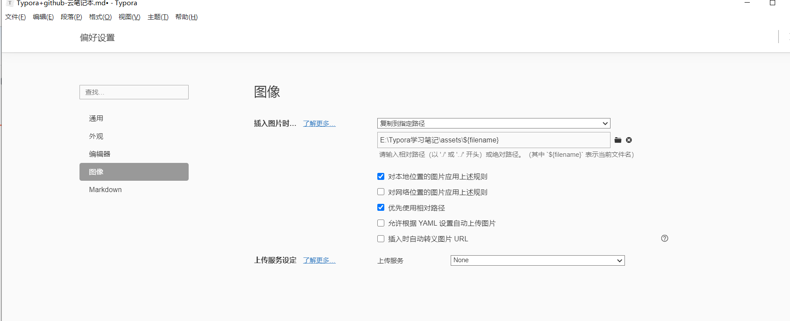
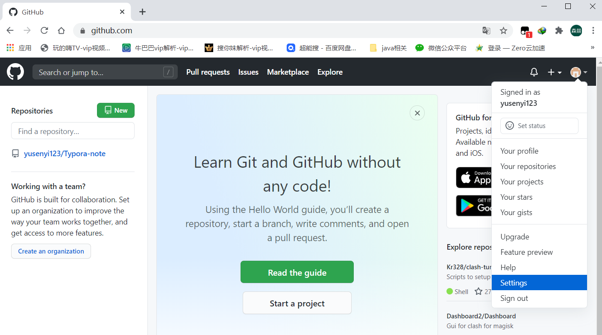
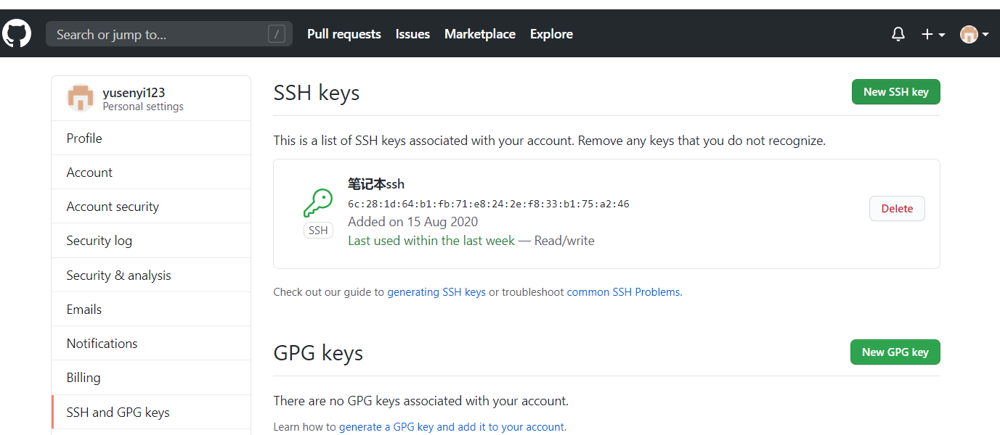
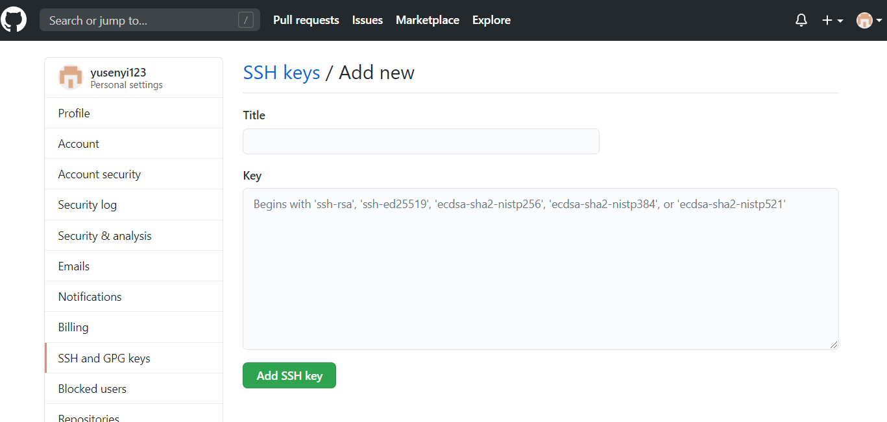
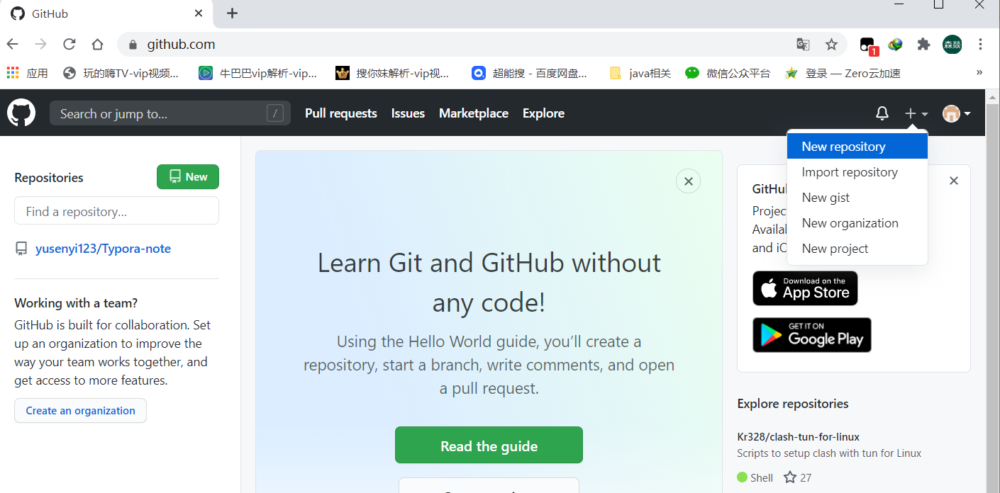
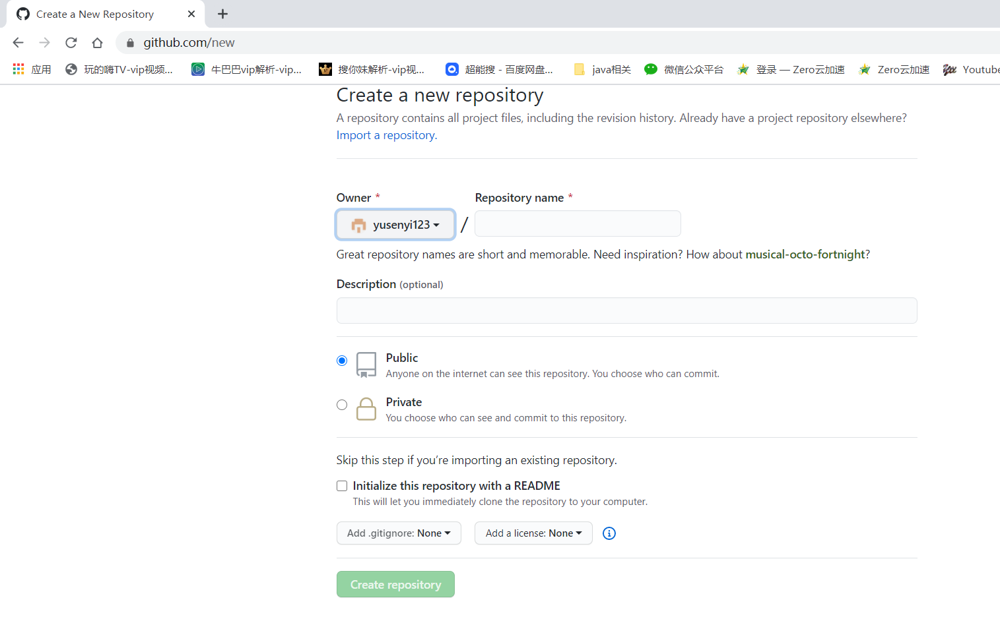
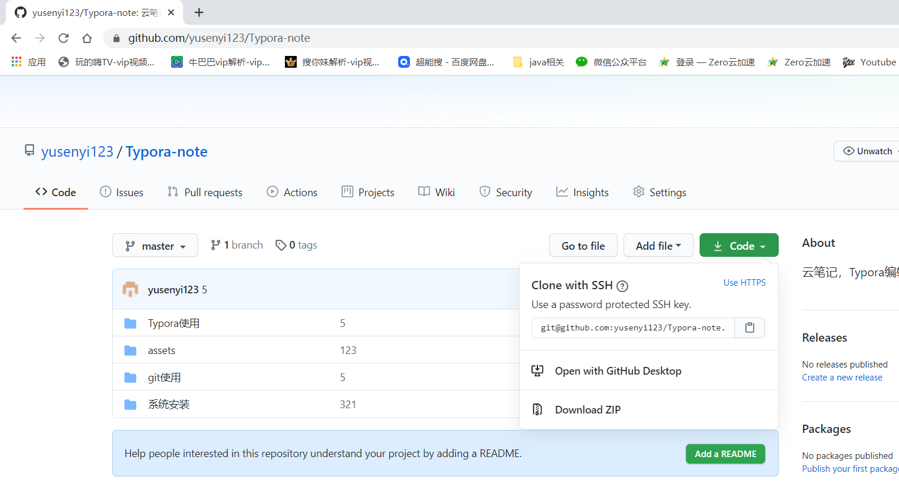
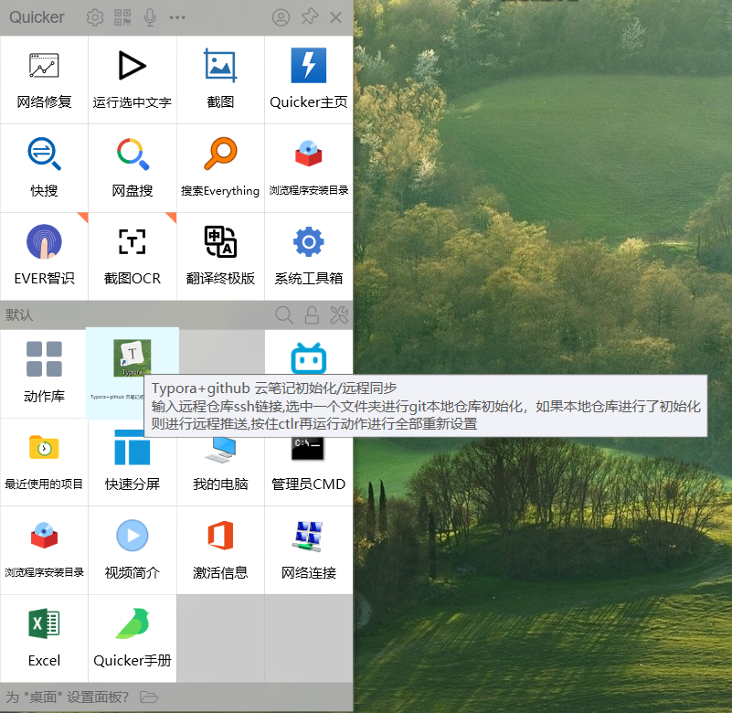

## 1. Typora介绍

Typora 是一款**支持实时预览的 Markdown 文本编辑器**。它有 OS X、Windows、Linux 三个平台的版本，并且由于仍在测试中，是**完全免费**的。下载地址：https://www.typora.io/

### 关于 Markdown

Markdown 是用来编写结构化文档的一种纯文本格式，它使我们在双手不离开键盘的情况下，可以对文本进行一定程度的格式排版。

由于目前还没有一个权威机构对 Markdown 的语法进行规范，各应用厂商制作时遵循的 Markdown 语法也是不尽相同的。其中比较受到认可的是 [GFM 标准](https://github.github.com/gfm/)，它是由著名代码托管网站 [GitHub](https://github.com/) 所制定的。Typora 主要使用的也是 GFM 标准。同时，你还可以在 `文件 - 偏好设置 - Markdown 语法偏好 - 严格模式` 中将标准设置为「更严格地遵循 GFM 标准」。具体内容你可以在官方的 [这篇文档](http://support.typora.io/Strict-Mode/) 中查看。


## 2.Typora安装和设置


### 2.1 图像设置，在这里设置插入图片的保存规则，选相对路径，在你的笔记目录下建一个文件夹专门存放图片，然后把放图片那个目录设置隐藏，这样在下面菜单中就不会显示了，都是我们的笔记看着很清爽





### 2.2 Markdown语法设置，就按照我图片这里设置就行，把大部分功能打开


## 3. Git安装 用github托管我们的笔记

[Git安装](../git使用/git安装.md)

### 3.1 生成ssh公钥,使用ssh公钥不需要每次向github提交都输入密码

```
打开git bash 输入下列代码
ssh-keygen -t rsa -C "your_email@example.com"

ssh-keygen -t rsa -C "2597400284@qq.com"

ssh-keygen -t rsa -f  E:\test   -C "test key"

ssh-keygen -t rsa -f  ~/.ssh/test   -C "test key"
代码参数含义：
-t 指定密钥类型，默认是 rsa ，可以省略。
-C 设置注释文字，比如邮箱。
-f 指定密钥文件存储文件名。

执行命令后需要进行3次或4次确认：

1.确认秘钥的保存路径（如果不需要改路径则直接回车）；
2. 如果上一步置顶的保存路径下已经有秘钥文件，则需要确认是否覆盖（如果之前的秘钥不再需要则直接回车覆盖，如需要则手动拷贝到其他目录后再覆盖）；
3.创建密码（如果不需要密码则直接回车）；（该密码是你push文件的时候要输入的密码，而不是github管理者的密码）
当然，你也可以不输入密码，直接按回车。那么push的时候就不需要输入密码，直接提交到github上了
这里我们选择按回车不输出密码
4. 确认密码；


执行完这个代码后在我们的用户目录下会生成一个.ssh的隐藏文件夹，文件夹里面有两个文件id_rsa和id_rsa.pub，前者是私钥，后者是公钥，复制id_rsa.pub的内容添加到github的ssh公钥处

```


### 3.2 将ssh公钥添加到github的sshkeys中







### 3.3  在github中新建仓库，获取仓库的ssh链接








### 3.4 笔记本文件夹初始化仓库，推送到github中

```
在笔记文件夹目录下 打开git bash 输入下列命令初始化本地仓库
git init 
```


## 4. 使用quicker 编写脚本进行一键初始化和远程同步，脚本基于以下命令

```
将笔记本文件夹下所有文件进行跟踪，提交所有变化

git add -A  提交所有变化

其他命令：
git add -u  提交被修改(modified)和被删除(deleted)文件，不包括新文件(new)

git add .  提交新文件(new)和被修改(modified)文件，不包括被删除(deleted)文件
```

```
生成一个本地库版本

git commit -m "提交注释2113"
```

```
将本地库版本推送到github中
git push   git@github.com:yusenyi123/notebook.git  master


git push  git@gitee.com:yusenyi/notebook.git master


```

### 4.1 quicker脚本链接:

https://getquicker.net/sharedaction?code=eab4e074-1096-4ee0-30eb-08d8405a0b37



### 4.2 脚本使用

第一次启动脚本会让你输入远程仓库的ssh链接和选择需要上传的笔记文件夹，第一次运行完之后脚本会记录你输入的远程仓库的ssh链接和你选择的文件夹，下次再运行就不需要设置。

如果要进行重新设置,按住ctrl再运行该活动，就会进入初始化设置状态重新设置ssh链接和选择要上传的文件夹


如果笔记文件夹没有本地初始化脚本第一次运行会进行初始化（不会上传内容到远程）

如果文件夹已经进行了本地仓库初始化，再次运行脚本就会直接把本地版本上传到远程仓库


## 5. 注意事项

###  4.1 笔记文件名不要包含空格，如果有空格那么上传到github中预览的时候将无法看到图片

### 4.2 笔记文件名不要太长，太长也会出现上述问题

