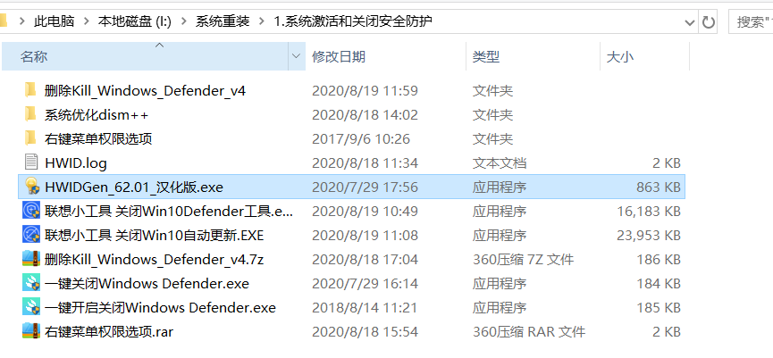
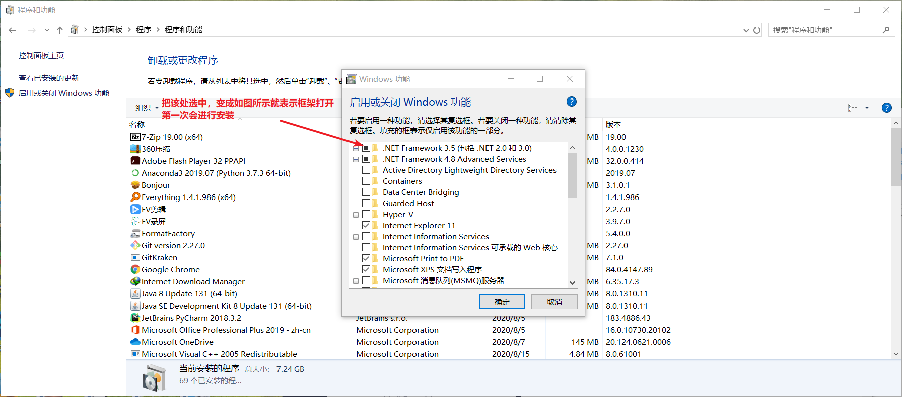
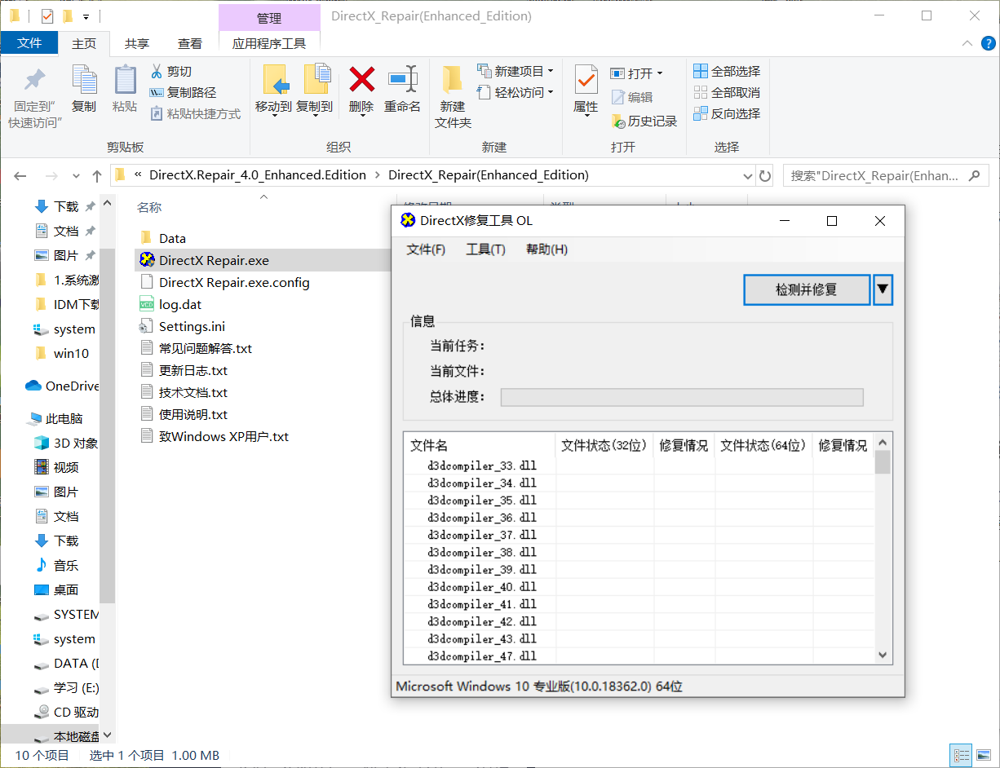

# 系统安装完后的步骤

## 1.关闭win10自带杀毒软件然后使用激活工具进行激活

彻底关闭win10杀毒软件: 联想开发的小工具

win10数字激活:HWIDGen_62.01_汉化版.exe

## 2. 安装驱动

现在的新的win10版本安装完成后，只要电脑联网会自动默默安装驱动，过一段时间电脑就会把大部分驱动都安装完，极个别硬件的驱动安装不上可以使用我给的两款无广告单文件的驱动精灵

## 3. 安装net 框架和C++运行库

### 3.1 安装.net框架

新的win10系统安装完成后自带.net4.8的框架，但我们依旧要把.net3.5的框架也一起安装上打开，

在控制面板-程序-卸载程序-启用或关闭windows 功能   

### 3.2 安装c++运行库

许多软件需要各个版本的C++运行库才能正常运行，我们需要把各个版本的C++运行库一起安装上

使用DirectX.Repair_4.0这个给工具一键全部安装

