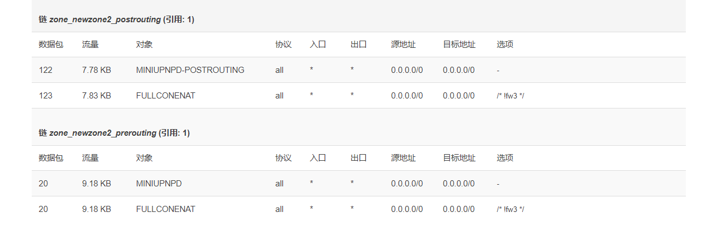
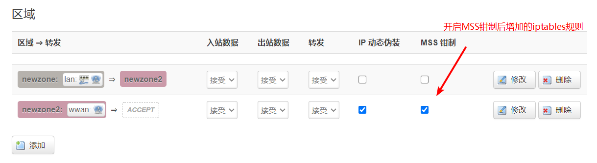
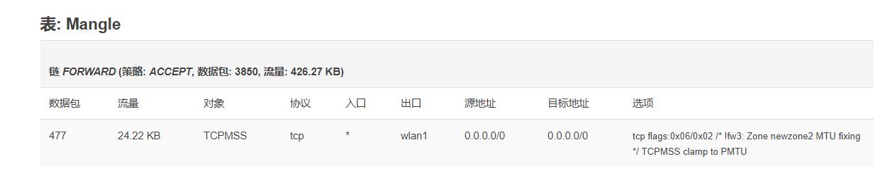
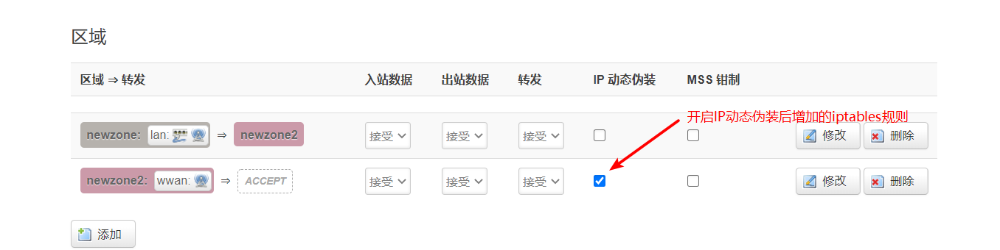
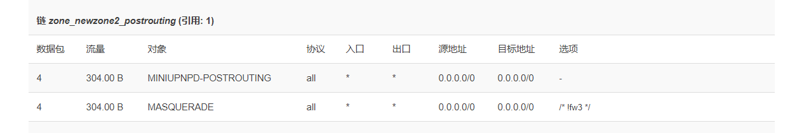
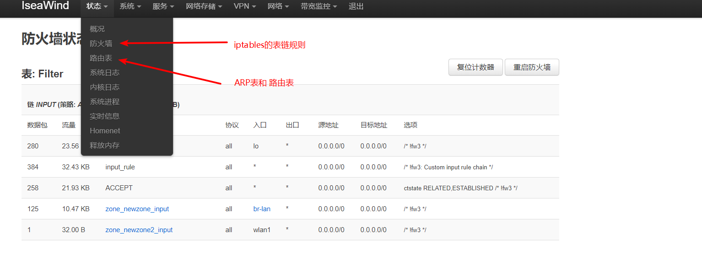

# openwrt不懂的点

## full cone nat开启添加的规则



## MSS钳制开启添加的规则

MSS（Maximum Segment Size，最大报文长度），是TCP协议定义的一个选项，MSS选项用于在TCP连接建立时，收发双方协商通信时每一个报文段所能承载的最大数据长度。






```
iptables -t nat  -A POSTROUTING -o wlan1 -j MASQUERADE
```


## IP动态伪装开启添加的规则






## 状态栏中的防火墙和路由表中的内容

