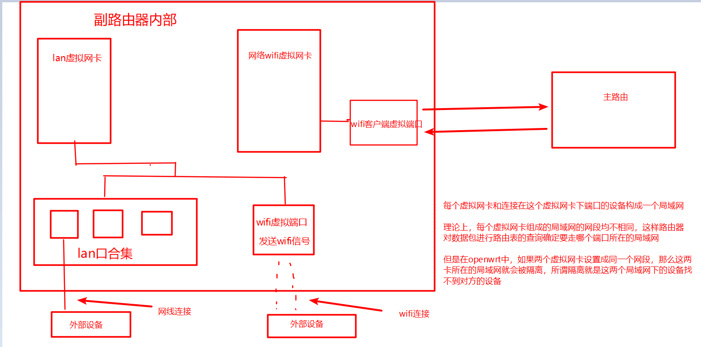
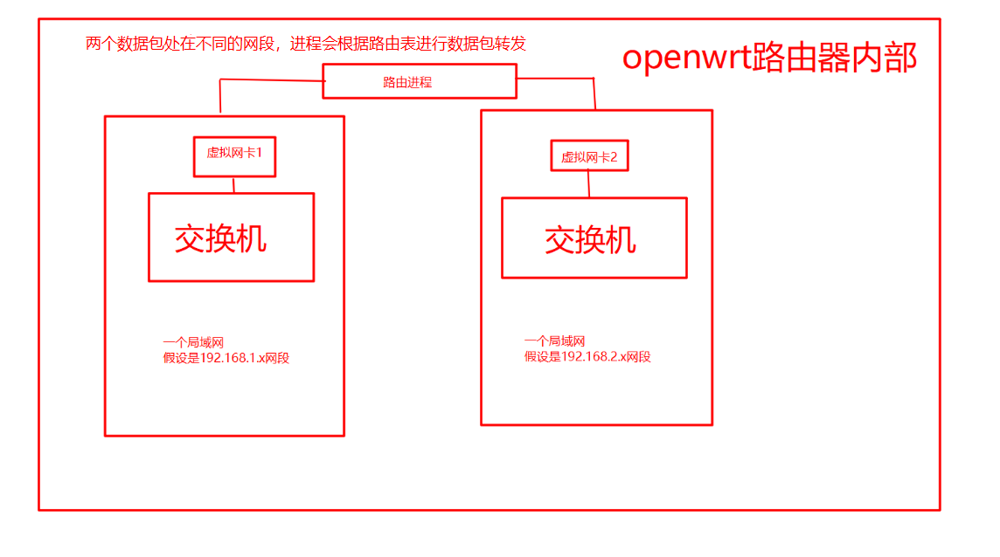
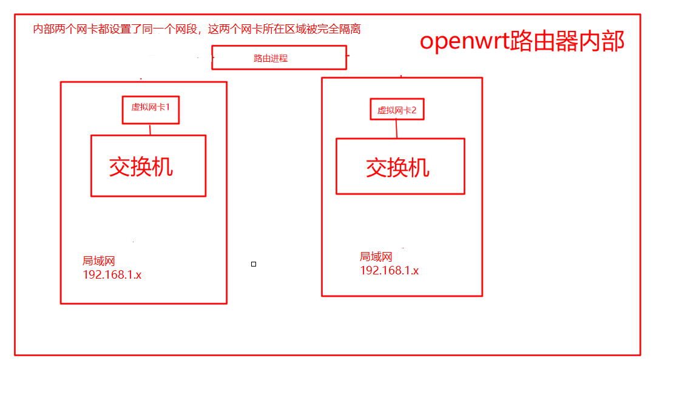

# openwrt中继的一些思考

在openwrt中，用无线网卡搜索wifi信号加入一个wifi的时候，如果要让这个wifi通道连通，不能把连接wifi的端口和其他端口进行桥接，（所谓桥接，作用类似在物理上这些端口互相连通就好像是一个交换机上的接口，桥接之后，连接在这些端口上的设备只要ip设置合理都是可以互相访问的，因为他们在物理上是连接在一起的）否则wifi连接就断开

按照下图设置，客户端的wifi断开就会断开


也正是因为不能使用桥接，导致这个连通另外一个路由器的无线端口不能和本身路由器上的其他端口构成交换机，也就无法和连接在其他端口上的设备构成局域网了




一堆端口（真实的物理端口，或者由物理端口产生的虚拟端口（虚拟端口链接在一个真实的物理端口，也起到相同作用，是程序为了扩展端口能够把一个真实的物理端口扩展成许多个虚拟的物理端口））桥接的作用可以理解成是构成了一个交换机

openwrt中的一个网络就是一个虚拟网卡+连接在这个虚拟网卡下的端口






路由器根据虚拟网卡所在的局域网自动生成路由表，当一个数据包到来的时候就根据路由表进行查询


```

命令查看的路由表
root@OpenWrt:~# route -n
Kernel IP routing table
Destination     Gateway         Genmask         Flags Metric Ref    Use Iface
0.0.0.0         192.168.1.1     0.0.0.0         UG    0      0        0 wlan1
192.168.1.0     0.0.0.0         255.255.255.0   U     0      0        0 wlan1
192.168.11.0    0.0.0.0         255.255.255.0   U     0      0        0 br-lan


路由记录讲解
0.0.0.0         192.168.1.1     0.0.0.0         UG    0      0        0 wlan1

如果数据包的目的网络是0.0.0.0 子网掩码是0.0.0.0    需要发送给网关192.168.1.1   该数据包从wlan1这个接口发出
```

