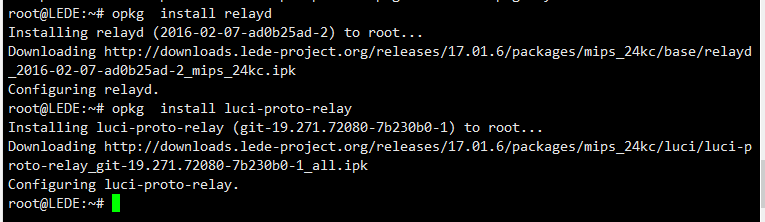
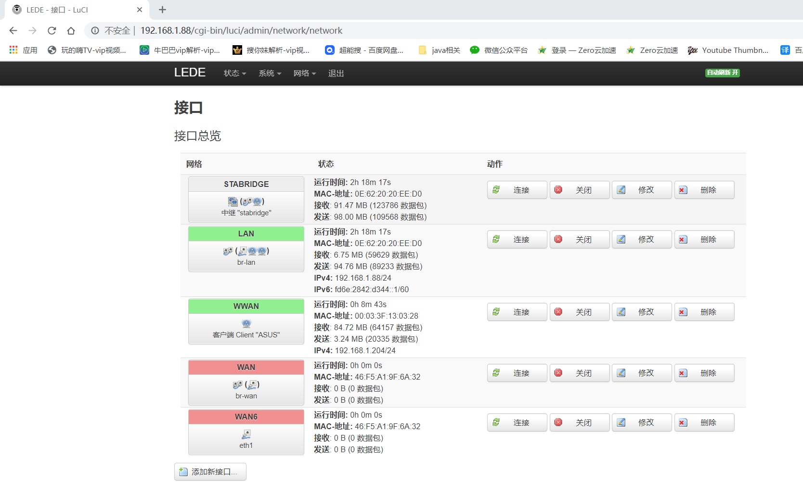
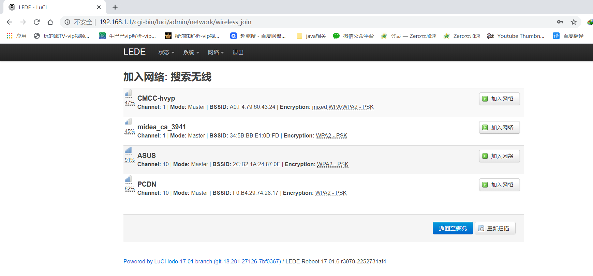

# openwrt无线互联

# 1. 中继模式

需要OpenWrt路由器内安装`relayd`和`luci-proto-relay`两个软件包。

==路由器联网后进行安装==

可以ssh登录后命令安装

```
opkg update
opkg  install relayd
opkg  install luci-proto-relay


opkg update 更新可以获取的软件包列表
opkg upgrade 对已经安装的软件包升级
opkg list 获取软件列表
opkg install 安装指定的软件包
opkg remove 卸载已经安装的指定的软件包


```



也可以在管理界面安装,先进行软件包更新在进行搜索，不然会找不到


### 概念

#### 1.openwrt设置中的接口和物理网卡的关系

openwrt界面中的接口

也即配置文件中的

config interface 'wan'
	option ifname 'eth1'
	option proto 'dhcp'
	option type 'bridge'


在openwrt系统中这个接口是概念上的接口（并不是物理接口，而是物理接口需要统一遵循的规范）可以理解成一个虚拟的网卡，我们把物理网卡==（包括物理网卡自身产生的虚拟网卡接口，如无线网卡就可以产生多个虚拟的无线接口）==添加到这个虚拟网卡上，物理网卡遵循这个虚拟网卡的配置，这个接口如果设置类型为bridge，那么则表示多个物理网卡相连统一由一个虚拟网卡进行管理

因为桥接设置是在接口内部进行设置，所以桥接只针对于在物理网卡（包括物理接口自身产生的虚拟接口）、

#### 2.openwrt无线互联使用过程中的情况

当我们进行无线互联的时候，openwrt系统的副路由器连接到主路由器的wifi的时候，==必须新建一个接口==，也就是需要新建一块虚拟网卡管理副路由器到主路由器的连接，但是这个接口不能设置brigde类型与其他物理接口相连接，如果进行了这个操作那么就会无限互联就会断开（所以我本来的想法是把其他的物理网卡和副路由器连接主路由器wifi的虚拟网卡接口 设置桥接来实现连接副路由的设备可以上网，但因为上面产生的问题，导致这个想法失败）


==所以想要实现openwrt中继模式下的无线互联，一个很重要的问题就是：怎么实现openwrt中接口直接数据的互通==

解决：需要新建一个接口，这个接口的协议是中继桥协议，这样通过这个接口就能把另外两个接口互联起来


### 实现步骤

#### 1.关闭副路由器lan接口上的dhcp功能，lan接口的ip地址的网段可以任意设置（有些教程上要求和主路由器在不同网段，这是对原理的不理解）

#### 2.在网络，无线界面选择你想要使用的无线网卡(现在的路由器一般都有5g和2.4g两个网卡，选择一个进行连接)点击搜索


#### 3.找到你需要连接的主路由器的网络，点击加入网络



#### 4.输入需要加入的无线网络的wifi密码，分配防火墙区域为lan


#### 5.保存应用


#### 6.网络-接口，点击添加新接口


#### 7.随意输出接口名字，选择接口桥协议进行创建


#### 8.如下配置，保存应用就完成了


#### 9.确保网络-防火墙 按照下图配置

